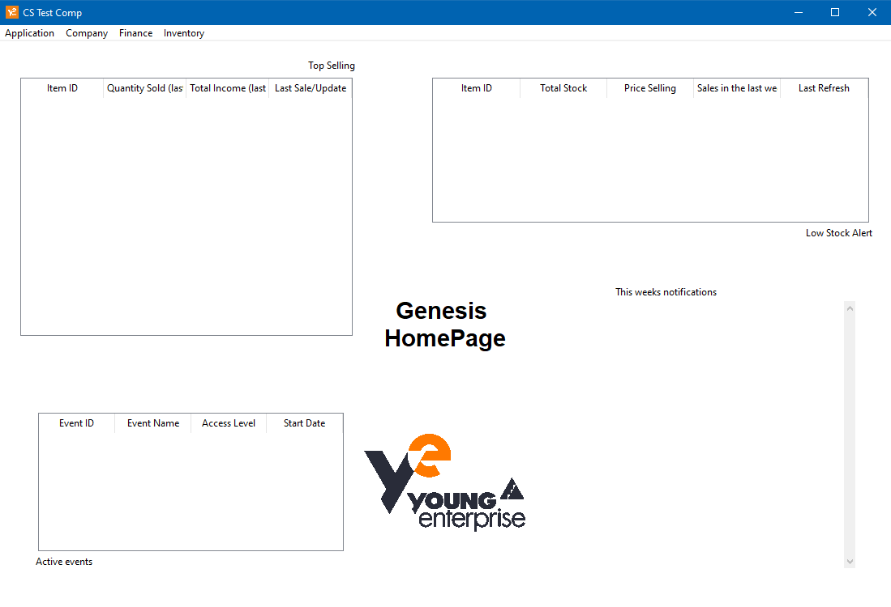
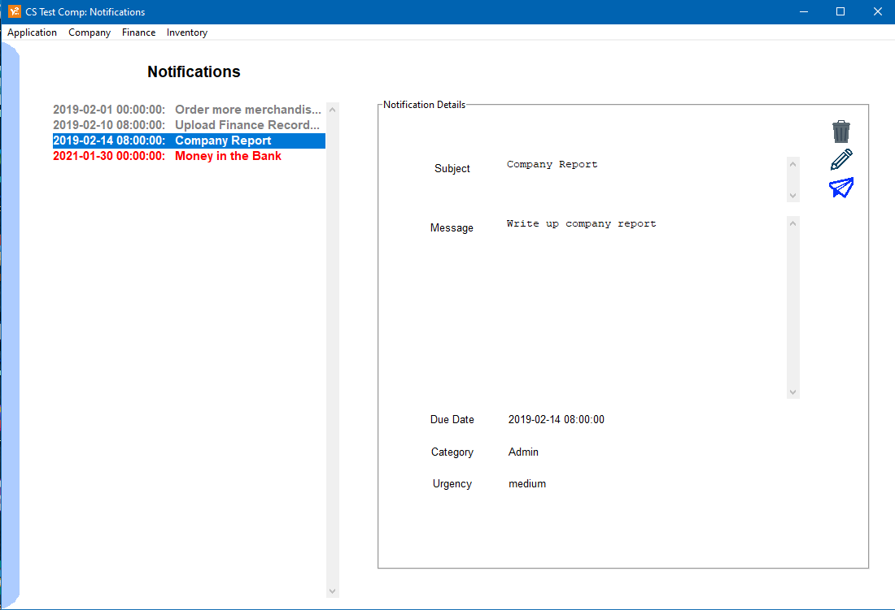
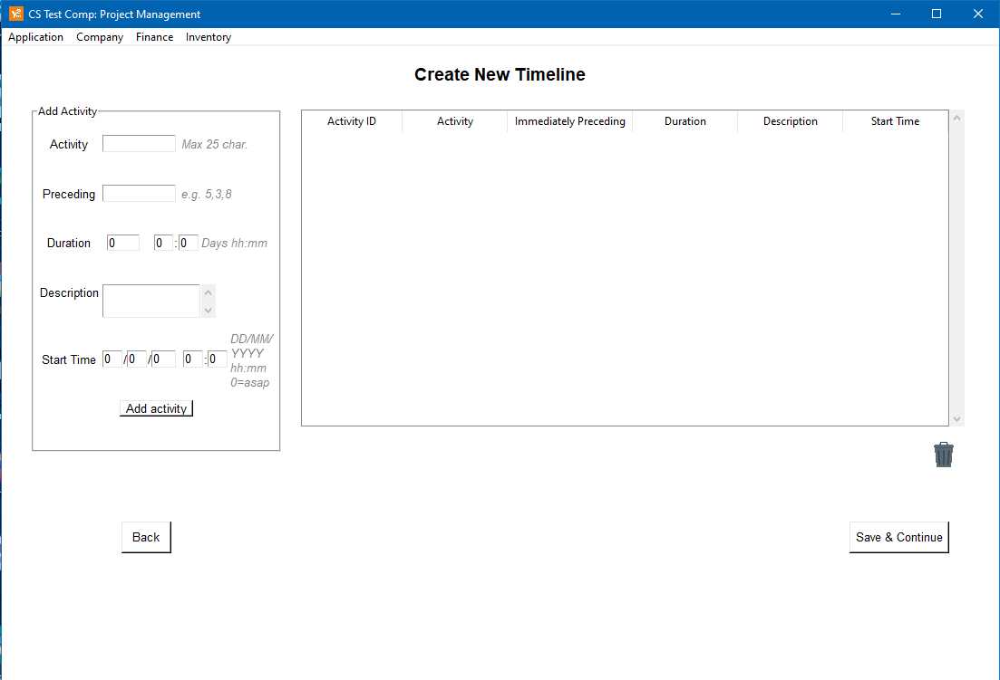
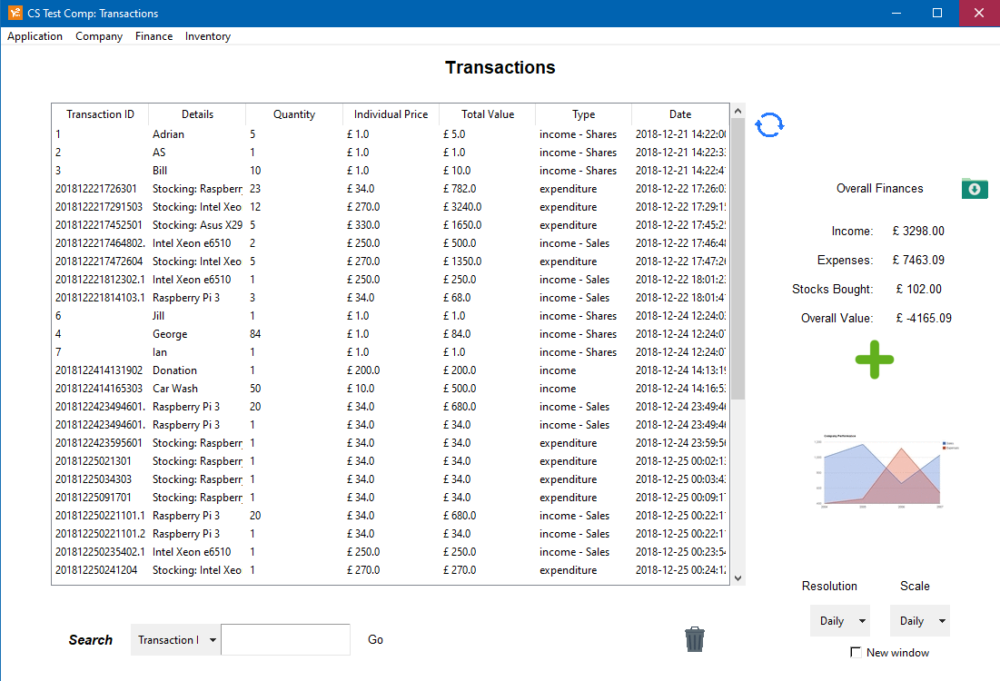

# Genesis Business Management

      _____ ______ _   _ ______  _____ _____  _____ 
     / ____|  ____| \ | |  ____|/ ____|_   _|/ ____|
    | |  __| |__  |  \| | |__  | (___   | | | (___  
    | | |_ |  __| | . ` |  __|  \___ \  | |  \___ \ 
    | |__| | |____| |\  | |____ ____) |_| |_ ____) |
     \_____|______|_| \_|______|_____/|_____|_____/ 

## A Young Enterprise (YE) Business Management Solution

### This project is **in no way affiliated** with the UK Young Enterprise programme!

## About

This project was built as part of my coursework, coinciding with the time I participated in the YE programme. A lot of the business management software at the time were big and complex let alone very expensive. This meant that even if we could access them, they would take too long for every member of the group to learn and that would be time taken away from product design, marketing or sales. This program was designed to handle all the data and admin tasks involved with running a YE company to make the business run smoother, so more time can be spent in product design, marketing and sales.

## Features

* Company notifications and messages board
* Employees database
* **Project management - Creates a Gantt chart of a project.** Helpful to show the latest time that each task must be done by in order to meet the whole project deadline
* Keeps track of shareholders and how many stocks they own. **Also allows purchasing stocks through PayPal**
* Keep track of inventory stock and **automatically price match items with eBay** to ensure you are always selling your products at the best deal for your customers
* **Allows customers to purchase your product through PayPal on the app.** Also has a returns feature to refund unhappy customers
* All the data is listed in clear tables in the app, and it automatically creates the best corresponding graph for each table. This is especially helpful for any reports that need to be made on the business at the end of the programme

## Classic vs. Extended edition

The extended edition was built for a bit of fun and so its extra features do not add much to the main purpose of this program - to aid and streamline the administrative tasks of running a YE business.

* It does not use the Young Enterprise icons or logos
* It features a small music jukebox in the app
* It has a debug logger tucked away in it
* Features a contact page to contact your company's support email
* Has a couple of easter eggs hidden inside!

## Running the program executable

1. Navigate to the `Releases` page of this Github Repo and download the desired edition and the corresponding `sql` file.
2. Load up the `dbScheme.sql` schema into MySQL
3. Navigate to config.ini file and change the host, user and password values under the mysql header to your details
4. Create and add a PayPal developer ID, eBay API key, and a gmail address (and password) to act as a mail server to send the emails. Add all those details to the config.ini file.
5. Launch the `exe` file
6. The program will take a few seconds to load up the necessary libraries and then it will run.

## Compiling python code to executable

If you want to compile the python code yourself, use `pyinstaller`. For reference, the pyinstaller manual is here: https://pyinstaller.readthedocs.io/en/stable/ 

1. Install the pyinstaller python module with `pip install pyinstaller`
2. In powershell or cmd, navigate to the project directory and run:

        pyinstaller -F --noconsole -n "Genesis-Classic" --add-data "[Python Install Location]/Lib/site-packages/matplotlib/;./matplotlib/" --add-data "[Python Install Location]/Lib/site-packages/plotly/;./plotly/" -i ".\Images\young enterprise 1.ico" .\Genesis.py

    * `-F`: Create a one file bundled executable
    * `-n`: Name to assign to the bundled app and spec file
    * `-i`: Apply the following ico file to the Windows executable's icon
    * `--add-data`: Used here to manually add the Matplotlib and Plotly python libraries to the executable. The locations will vary from system to system, but usually they are located in: `[Python-install-location]/Lib/site-packages/`

## Running the program python file

1. run `pip install -r requirements.txt` in the project folder
   * Alternatively, manually pip install the following packages:
     1. paypalrestsdk
     2. ebaysdk
     3. bs4
     4. mysql-connector-python
     5. matplotlib
     6. plotly
     7. xlwt
     8. numpy
2. **Ensure tkinter is installed**
3. Import the dbScheme.sql schema into MySQL
4. Alter the config.ini file's host, user and password values under the mysql header to your details
5. Create and add a PayPal developer ID, eBay API key, and a gmail address (and password) to act as a mail server to send the emails
6. Open the python program in IDE of choice and run it

## Loading an sql schema into MySQL

1. Download the MySQL Community Server (Windows link: https://dev.mysql.com/downloads/mysql/)
2. Once installed, open MySQL workbench
3. Click a connection (i.e. localhost)
4. On the menu bar, go to Server > Data Import
5. Select `Import from self-contained file` and add the path of `dbScheme.sql`
6. Leave `Default Target Schema` blank
7. At the bottom, make sure the option menu (next to the greyed out `Select Views` button) is set to `Dump Structure and Data`
8. Press `Start Import`

The database will need to be set up on only one computer. Users will only be able to use app whilst the computer storing the database is running. The mysql host address for the conf.ini file will be the local IP address of the machine running the database.

## Notes

* Ensure the Images, config.ini and Logs folder are in the same directory as the program file
* The program was tested and run in Python 3.4.4 and Python 3.7
* This project was created as part of my coursework from Secondary School, so there are no plans to update it in the future. That said, if you file an issue on GitHub for a bug or assistance with setup, I will try my best to assist or at least point you in the direction of a solution

## Screenshots

The following are a handful of pages from the program. The coursework was built in Python and uses the TKinter module for the graphical user interface. As such, the style of the interface is very basic.

The home dashboard showing you all the important information for your company:

The notifications page:

Creating a new project Gantt chart:

Transactions page:

